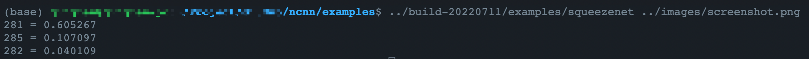
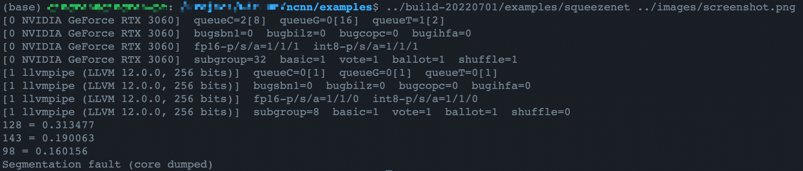
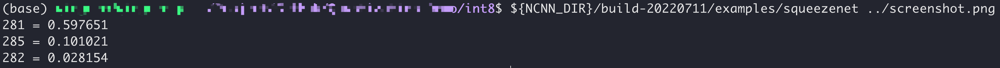

# Week1

## Build NCNN
根据文档[how to build ncnn](https://github.com/Tencent/ncnn/wiki/how-to-build#build-for-linux)， 克隆并编译ncnn。

使用的设备是x86架构，nvidia 3060。

1.推理不使用VULKAN
```bash
cd ncnn
mkdir -p build-20220711
cmake -DCMAKE_BUILD_TYPE=Release -DNCNN_BUILD_EXAMPLES=ON ..
make -j$(nproc)
# 安装： make install
```

2.下载[测试样本](https://github.com/nihui/ncnn-android-squeezenet/blob/master/screenshot.png)至`ncnn/images`，运行squeezenet Demo，验证ncnn推理是否正常:

<left></left>

```bash
cd ncnn/examples
../build-20220711/examples/squeezenet ../images/screenshot.png
```

<left></left>

置信度最高的三个类别索引分别为`281,285,282`。
索引+1对应文件[synset_words.txt](https://github.com/Tencent/ncnn/blob/master/examples/synset_words.txt)中的行号。
可以得知`281: tabby, tabby cat`, `285: Egyptian cat`, `282: tiger cat`。

置信度最高的三个类别都与`cat`有关, 推理是正确的。

---

1.推理时使用VULKAN:
```bash
cd ncnn
mkdir -p build-20220701
cmake -DCMAKE_BUILD_TYPE=Release -DNCNN_VULKAN=ON -DNCNN_BUILD_EXAMPLES=ON ..
make -j$(nproc)
# 安装： make install
```

2.运行squeezenet Demo，验证ncnn推理是否正常:

```bash
cd ncnn/examples
../build-20220701/examples/squeezenet ../images/screenshot.png
```

<left></left>

置信度最高的三个类别索引分别为`128,143,98`。
索引+1对应文件[synset_words.txt](https://github.com/Tencent/ncnn/blob/master/examples/synset_words.txt)中的行号。
可以得知`128: black stork, Ciconia nigra`, `143: oystercatcher, oyster catcher`, `98: red-breasted merganser, Mergus serrator`。

测试样本对应的类别应该是`cat`, 这里推理出了一些问题。

暂时不使用VULKAN进行推理，这可能存在一些问题。

## 量化Squeezenet

根据[qunatization-int8-reference](https://github.com/Tencent/ncnn/blob/master/docs/how-to-use-and-FAQ/quantized-int8-inference.md)对squeezenet进行量化。


1.Optimize model

```bash
${NCNN_DIR}/build-20220711/tools/ncnnoptimize \
fp32/squeezenet_v1.1.param \
fp32/squeezenet_v1.1.bin \
opt/squeezenet_v1.1-opt.param \
opt/squeezenet_v1.1-opt.bin \
0
```

2.Create the calibration table file

需要下载[校准集](https://github.com/nihui/imagenet-sample-images)，并提供imagelist.txt。

```bash
# Create calibration table file
${NCNN_DIR}/build-20220711/tools/quantize/ncnn2table \
opt/squeezenet_v1.1-opt.param \
opt/squeezenet_v1.1-opt.bin \
imagelist.txt \
squeezenet_v1.1.table \
mean=[104,117,123] \
norm=[1,1,1] \
shape=[227,227,3] \
pixel=BGR \
thread=1 \
method=kl
```

3.Quantize model
```bash
${NCNN_DIR}/build-20220711/tools/quantize/ncnn2int8 \
opt/squeezenet_v1.1-opt.param \
opt/squeezenet_v1.1-opt.bin \
squeezenet_v1.1-int8.param \
squeezenet_v1.1-int8.bin \
squeezenet_v1.1.table
```

4.Inference
```bash
cd int8
ln -s squeezenet_v1.1-int8.bin squeezenet_v1.1.bin
ln -s squeezenet_v1.1-int8.param squeezenet_v1.1.param
${NCNN_DIR}/build-20220711/examples/squeezenet ../images/screenshot.png
```
<left></left>

