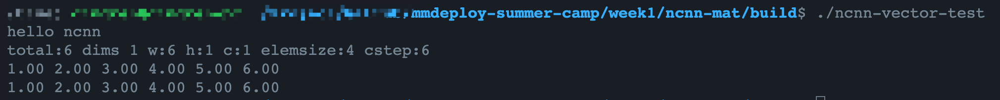
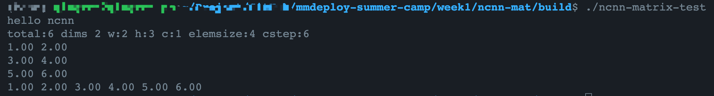
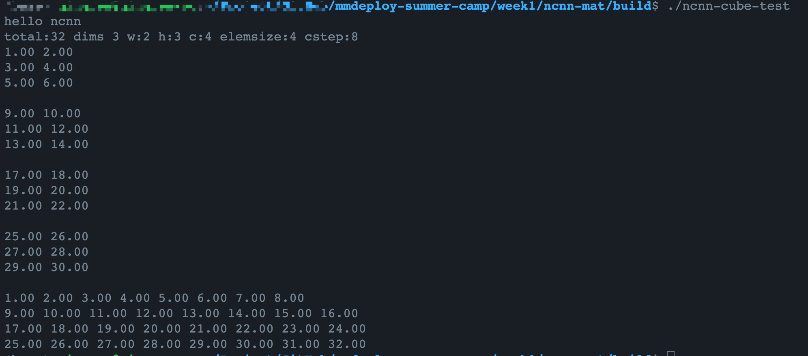

# ncnn::Mat

参考[知乎专栏-ncnn初探二: 图解ncnn::Mat的内存排布](https://zhuanlan.zhihu.com/p/336359747)

[Mat类](https://github.com/Tencent/ncnn/blob/master/src/mat.h)有几个关键属性
- data: 表示Mat分配的内存的头地址，void*类型
- dims: 表示数据的维度, 是一个整数类型
- w: 表示数据的width, 是一个整数类型
- h: 表示数据的height, 是一个整数类型
- c: 表示数据的channel, 是一个整数类型
- elemsize: 表示打包在一起的数据占的字节数, 是一个整数类型
- cstep: 表示channel step, 即走一个channel跨过的字节数, 是一个整数类型
- elempack: 表示有多少个数据打包在一起, 是一个整数类型

看三个例子:

## 1.vector
```C++
// 定义长度为6的向量
ncnn::Mat m(6); 
printf("total:%ld dims %d w:%d h:%d c:%d elemsize:%ld cstep:%ld\n", \
m.total(), m.dims, m.w, m.h, m.c, m.elemsize, m.cstep);

// total()返回 cstep * c, 对于vector而言c_step=w, c=1
for (int i = 0; i < m.total(); i++) 
    m[i] = i+1;

// 打印
const float* r = m.row(0);
for (int i = 0; i < m.w; i++)
    printf("%.2f ", r[i]);
printf("\n");

// 打印
const float* ptr = (float*) m.data;
for (int i = 0; i < m.cstep; i++)
    printf("%.2f ", ptr[i]);
printf("\n");
```

<left></left>

结果显示：总元素数量6，维度为1，数据宽度为6，数据的高和通道数为1，一个通道包含6个数据。

## 2.Matrix

```C++
// 定义宽为2，长为3的矩阵
ncnn::Mat m(2, 3);
printf("total:%ld dims %d w:%d h:%d c:%d elemsize:%ld cstep:%ld\n", m.total(), m.dims, m.w, m.h, m.c, m.elemsize, m.cstep);
    
// total() 返回 cstep * c, 对于matrix而言c_step=w*h, c=1
for (int i = 0; i < m.total(); i++)
    m[i] = i+1;
    
// 打印
for (int i = 0; i < m.h; i++) {
    const float* r = m.row(i);
    for (int j = 0; j < m.w; j++) {
        printf("%.2f ", r[j]);
    }
    printf("\n");
}

// 打印
const float* ptr = (float*) m.data;
for (int i = 0; i < m.cstep; i++) {
    printf("%.2f ", ptr[i]);
}
printf("\n");
```

<left></left>

结果显示：总元素数量6，维度为2，数据宽度为2，数据的高为3，通道数为1，一个通道包含6个数据。

## 3.Cube
```C++
    // 定义宽为2，长为3，通道数为4的矩阵
ncnn::Mat m(2, 3, 4);
printf("total:%ld dims %d w:%d h:%d c:%d elemsize:%ld cstep:%ld\n", m.total(), m.dims, m.w, m.h, m.c, m.elemsize, m.cstep);

// total() 返回 cstep * c, 对于cube而言cstep=alignSize((size_t)w * h * elemsize, 16), c=4
// alignSize(a, 16) 返回大于等于a的16的最小倍数
for (int i = 0; i < m.total(); i++)
    m[i] = i+1;
    
// 打印
for (int i = 0; i < m.c; i++) {
    ncnn::Mat middle = m.channel(i);
    for (int j = 0; j < m.h; j++) {
        const float* r = middle.row(j);
        for (int k = 0; k < m.w; k++) {
            printf("%.2f ", r[k]);
        }
        printf("\n");
    }
    printf("\n");
}
    
// 打印
for (int i = 0; i < m.c; i++) {
    ncnn::Mat middle = m.channel(i);
    float* ptr = (float*) middle;
    for (int j = 0; j < m.cstep; j++){
        printf("%.2f ", ptr[j]);
    }
    printf("\n");
}
```

<left></left>
结果显示：总元素数量32，维度为3，数据宽度为2，数据的高为3，通道数为4，一个通道包含8个数据。

观察打印的信息， total()的值比w\*h\*c要大。
这里体现出了Mat中数据排布的[内存对齐策略](https://github.com/Tencent/ncnn/issues/334)。

每个通道是按照16字节对齐的, 多余元素的会被补齐。详细地说，对于此例子，一个通道包含6(w\*h=2\*3)个有效数据，每个数据是fp32类型占4个字节，6个有效一共占24字节。根据内存对其策略，大于等于24而且能被16整除的数为32，于是在内存中，每个通道需要开辟32个字节的空间。