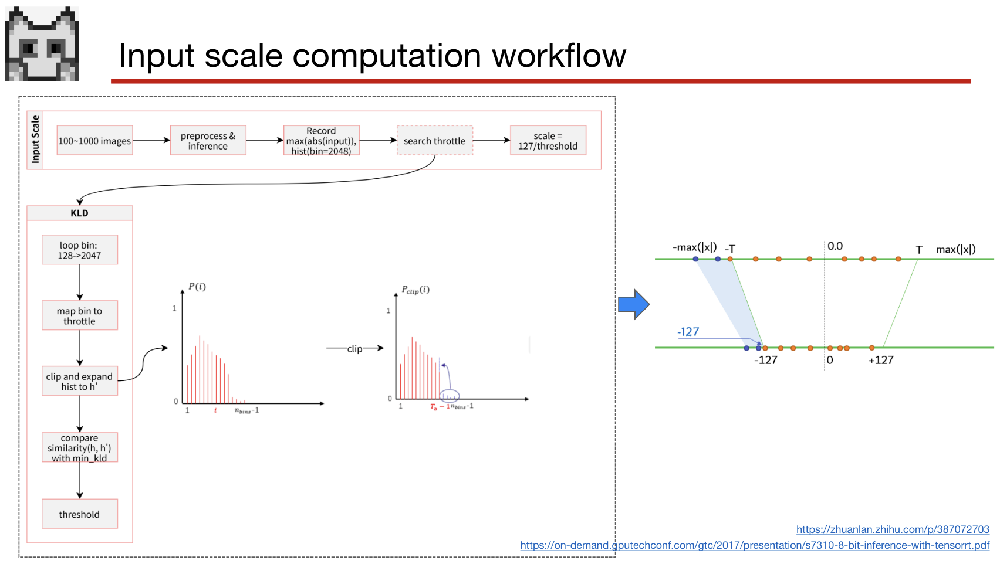

# Week2

## 1. 论文阅读

- [*Quantization and training of neural networks for efficient integer-arithmetic-only inference*](https://openaccess.thecvf.com/content_cvpr_2018/html/Jacob_Quantization_and_Training_CVPR_2018_paper.html): [📝笔记](paper1.md)

- [*EasyQuant: Post-training Quantization via Scale Optimization*](https://arxiv.org/abs/2006.16669): [📝笔记](paper2.md)

---

## 2. 对称量化和非对称量化

---

## 3. ncnn的量化方案

参考：[知乎：MegFlow和ncnn int8简介](https://zhuanlan.zhihu.com/p/476605320)

ncnn所采用的是一种后训练的对称量化方案，具体实现见[ncnn2table](https://github.com/Tencent/ncnn/blob/master/tools/quantize/ncnn2table.cpp)。

### 3.1量化机制

$q = clamp(round(r*S))$

其中$q$是量化后的参数，为int8类型；$r$为权重或激活值的真实值，为fp类型；$S$为量化参数-缩放系数，每个卷积核或每层的激活值都具有一个与之对应的量化参数。

### 3.2确定量化参数

以“kl”量化方法为例，介绍量化参数是如何确定的。

**1.确定模型权重的量化参数**

$S = 127 / absmax(W)$

其中$absmax(W)$是卷积核权重$W$中的最大绝对值。

**2.确定各层激活值（特征图）的量化参数**

<left></left>

上图描述了确定激活值的量化参数的过程。
1. 准备矫正集，将其送入模型，用于获得各层激活值的分布。
2. 统计每一层激活值中的最大绝对值m及其分布。（统计激活值分布时设置了2048个等间隔的bin, 间隔大小为st0=2048/m）
3. 设置一个阈值$t \in [128,2048)$。
    - 计算裁切后的分布`clip_distribution`: 设置t个bins，将2048个bins中索引大于t的bin中的元素，全部统计至第t个bin中。如上图中部所示。
    - 计算量化后的分布`quantize_distribution`：设置128个bins，每个bins对应的间隔st1=st0*(t/128)。也就是将2048个bins中的前t个bins的数据重新划分至128个bins中。
    - 对量化后的分布进行扩张`expand_distribution`：将128个bins的数据扩张至t个bins中。
    - 度量`clip_distribution`和`expand_distribution`两个分布之间的KL散度。
4. 重复第三步的操作，找到一个合适的阈值t，使得KL散度最小，即`clip_distribution`和`expand_distribution`最接近。
5. 对阈值t做一个映射，将其从bin的索引映射至真实值。真实的阈值为$t'=(t+0.5)/2048*m$
6. 确定缩放尺度$S=127/t'$

经过此过程，即可生成一个量化参数表。例如week1量化squeezenet任务中所生成的[squeezenet_v1.1.table](week1/Quantize-squeezenet/squeezenet_v1.1.table)。

上述过程的[Python实现](https://github.com/BUG1989/caffe-int8-convert-tools/blob/93ec69e465252e2fb15b1fc8edde4a51c9e79dbf/caffe-int8-convert-tool-dev-weight.py#L483)和C++实现是同一个大佬写的。

### 3.3 将模型转换至int8

[ncnn2int8](https://github.com/Tencent/ncnn/blob/master/tools/quantize/ncnn2int8.cpp)实现了以下功能：
- 将模型权重量化成int8。
- 根据量化参数表，将量化参数绑定至各层中。
- 将反量化操作和重量化操作融合成一个操作。如下图所示。

<left></left>

经过上述过程，会生成量化后的模型权重。例如week1量化squeezenet任务中所生成的`squeezenet_v1.1-int8.bin`和`squeezenet_v1.1-int8.param`。


## 4. ncnn-int8 的卷积实现

具体实现见[源码](https://github.com/Tencent/ncnn/blob/master/src/layer/convolution.cpp)。

对于一个卷积层来说，其对应的量化参数如下所示，其中`weight_data_int8_scales`是卷积权重对应的量化参数，而`bottom_blob_int8_scales`和`bottom_blob_int8_scales`分别对应卷积输入特征图对应和输出特征图对应的参数。

```C++
// Convolution class
#if NCNN_INT8
    Mat weight_data_int8_scales;
    Mat bottom_blob_int8_scales;
    Mat top_blob_int8_scales;
#endif
```

其中`weight_data_int8_scales`是模型权重对应的缩放因子。

其中`bottom_blob_int8_scales`是当前卷积层输入特征图对应的缩放因子。

而`top_blob_int8_scales`则当前卷积层的下一个卷积（全连接）层输入特征图对应的缩放因子。

forward_int8的流程:

1. 基于input_scale，对输入的特征图进行量化。
2. 对于一个卷积核作一次卷积输出的的int32类型的累加和sum，进行反量化，即 sumfp32 = sum / (weight_scales * input_scale)。
3. 在sumfp32的基础上加上bias，通过激活函数。
4. 对输出的激活值重量化：sumfp32 * scale_out。这一步基于的模型结构，也可能不做，如3.3图所示。
5. 重复上述的2，3，4步直到完成整个卷积操作。

input_scale=`bottom_blob_int8_scales`

weight_scales=`bottom_blob_int8_scales`

scale_out=`top_blob_int8_scales`
