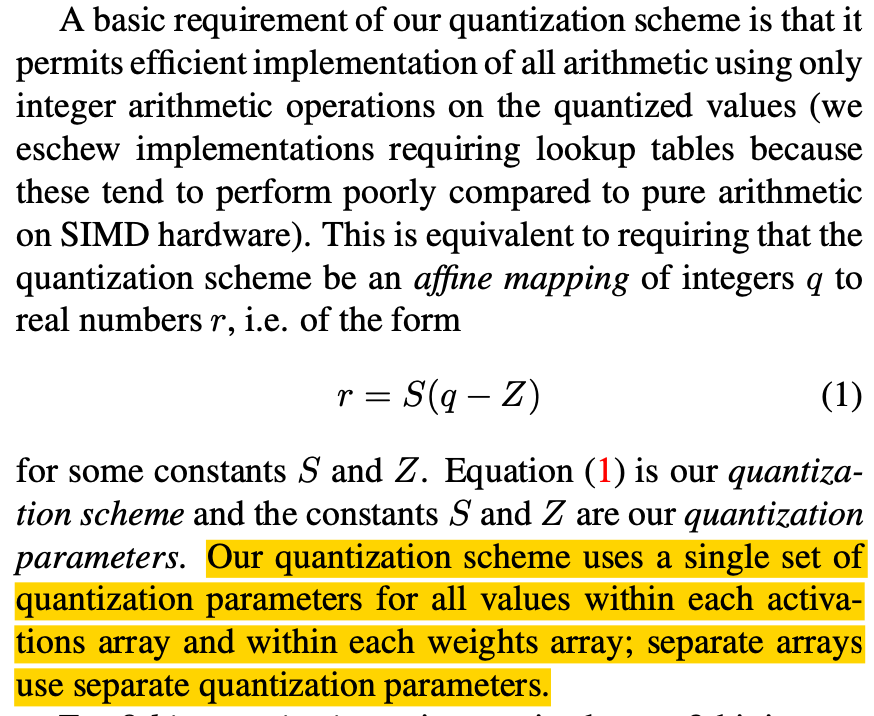
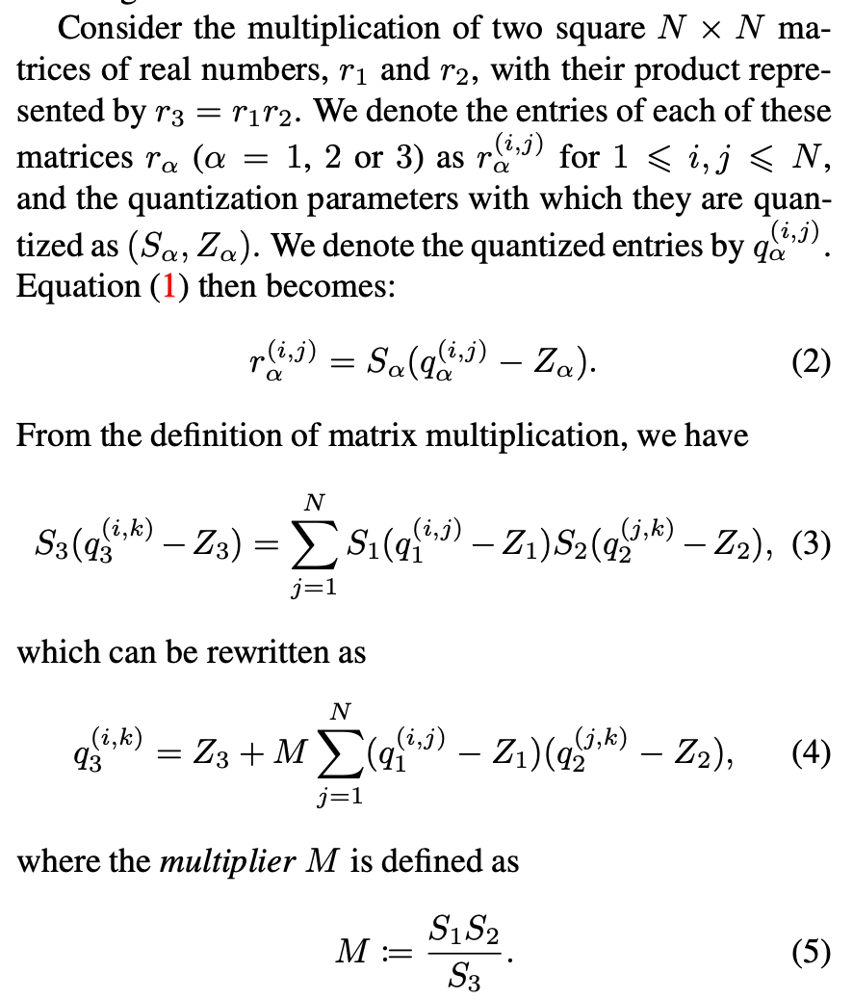
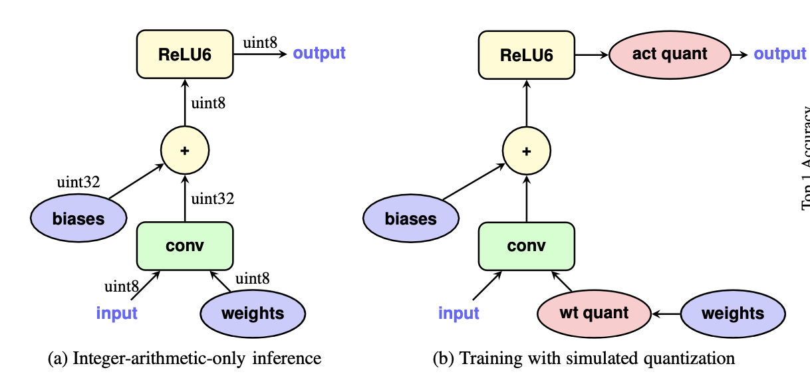
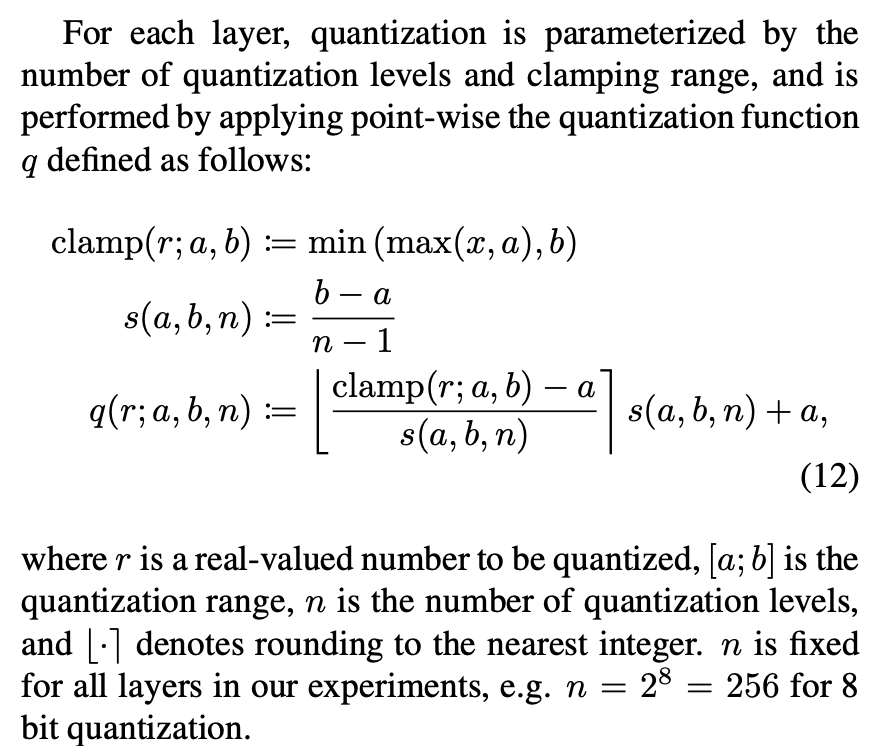
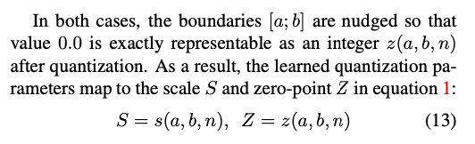

## [*Quantization and training of neural networks for efficient integer-arithmetic-only inference*](https://openaccess.thecvf.com/content_cvpr_2018/html/Jacob_Quantization_and_Training_CVPR_2018_paper.html)

**Motivation**

1. 之前的量化算法大多是在过参数化的模型（AlexNet，VGG，GoogleNet）上进行的评估。但是在结构设计已经轻量高效的模型（Mobile Net）上进行量化是更有意义的。
2. 许多量化方法在真实硬件上不一定有效。

总之，这些量化算法，在模型精度和模型推理速度这两方面没有取得平衡。

**Contribution**

1. 作者提出了一种量化机制。量化后的模型，模型权重（weight）和激活值（activations）都是int8类型，而少部分参数（bias）是int32类型。
2. 作者提出了一种量化推理框架。
3. 作者提出了一种量化训练框架。

这是第一篇Quantization-aware Training的方法。作者通过在训练过程中模拟量化过程，从而引入量化误差，然后通过训练调整模型参数来弥补量化误差，最终可以得到一组微调后的模型参数，而在量化后模型也能有好的性能。

可以从三个方面来了解该量化方案：1.量化机制是什么 2.量化后如何推理 3.量化参数如何获得 

---

### 1.量化机制

对应原文的2.1部分。

<left></left>

公式1描述的是整数->浮点数的映射，其中$S$表示缩放的尺度，是一个浮点数；$Z$表示零点，是一个整数。

每一个激活值数组（一个特征图）或每一个权重数组（一个卷积核）都有其对应的量化参数$S,Z$。

即：只要知道网络各层激活值和权重对应的量化结果和量化参数，就可以进行推理了。

---

### 2.如何推理

对应原文的2.2，2.3，2.4部分。

<table width=80%>
<tr>
<td></td>
<td></td>
</tr>
</table>

公式4描述了利用量化后的数据$q_1,q_2,q_3$和其对应的量化参数$\{S_1,Z_1\},\{S_2,Z_2\},\{S_3,Z_3\}$来近似基于真实数据的矩阵乘法。

这里$M$仍是一个浮点数，需要与一个整数项相乘。为了避免浮点运算带来的计算开销，这里作者采用了定点乘法。将浮点数同整数的乘法转换成了整数同整数的乘法和位移操作的结合。如下公式所示，其中Q代表一个整数：

$M \times Q \rightarrow [round( (1<<31) \times M_0) \times Q] >> (31+n) $

> 💡关于n如何取值的理解：
> 
> $n$是根据$M$的范围确定的，从小到大枚举$n$至$2^n \times M$，即$M_0$，在区间$[0.5,1)$内。
>
> 💡关于要求$M_0 \in [0.5,1)$的理解：
> 
> 现在有两个条件
> 
> 条件1: $M_0$的整数表示不能溢出，那么要求$M_0<1$
> 
> 条件2: $0<M<1$, $M_0=2^{n}M_0$
> 
> 而$n$越大，定点乘法的精度越高，所以要求n能取到满足上述两个条件的最大值。$M_0$是关于$n$单调递增的，因此n取到最大值的条件是：
>
> $\begin{cases} 2^n M<1 \\\\ 2^{n+1} M \geq 1 \end{cases} \Rightarrow 0.5 \leq M_0 < 1$
> 根据上述分析，在推理的过程中，乘法运算就不用涉及到操作浮点数了。

如下图a所示，文中还分析了量化后的卷积运算的规则，其中累加器的bias都是int32位的类型，这里就不多做解释了。

<left></left>

---

### 3.量化参数如何获得

该量化方案在推理时仅使用整数运算，但是在训练时使用浮点运算。

如上图b所示，在训练时，需要插入量化模块（即权重量化和激活只量化模块），再按照推理的规则（公式4）进行前向传播，但此时的运算均为浮点运算，不需要使用定点乘法这种操作。

量化模块指的是如下操作：

<left></left>

对于权重和激活值的量化，量化范围\[a,b\]，的取值策略不同。在训练时，模型权重和激活值会随着梯度反向传播发生变化，同时其对应的量化范围\[a,b\]也会按照对应的策略进行调整。

而a和b是可以映射至S和Z的，如下述所示：

<left></left>

所以根据公式13，可以计算出量化参数。

**总结一下该量化方案**：
1. 确定各层权重和激活值对应的量化范围\[a,b\]
2. 训练阶段：浮点运算，插入量化模块，根据公式12进行伪量化，按照公式4进行前向传播。反向传播更新模型权重，并根据权重和激活值的变化，调整对应的量化范围。
3. 训练结束：根据公式12，对各层权重和激活值进行量化，计算对应的q。根据公式13，计算对应的S和Z。
4. 推理阶段：整数运算，根据公式4，基于各层权重和激活值对应的q，S，Z进行前向传播

