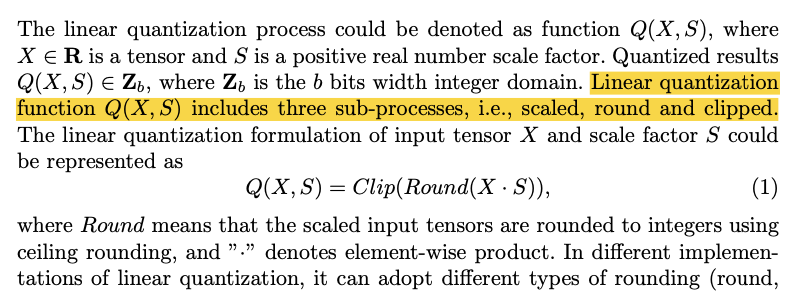
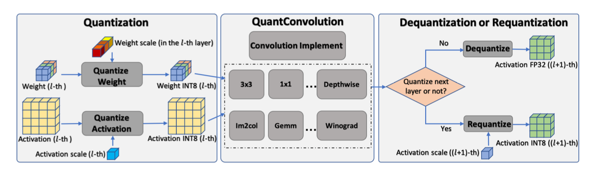
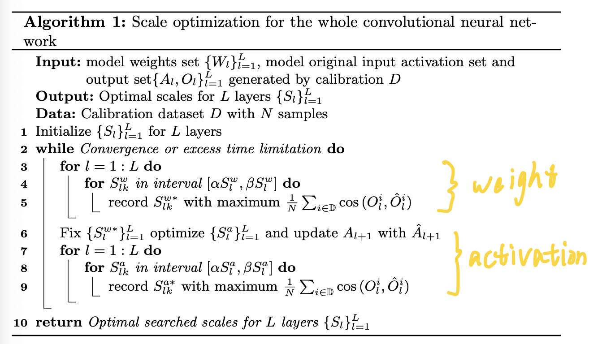
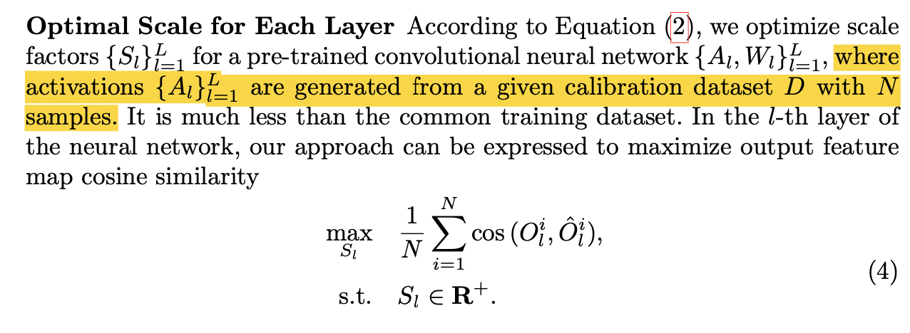

## [*EasyQuant: Post-training Quantization via Scale Optimization*](https://arxiv.org/abs/2006.16669)

**Motivation**:

1. 基于训练的量化方法存在两个问题：1.训练一个量化网络非常耗时2.模型的训练好坏取决于训练经验3.某些场景下可能无法得到模型的训练数据。因此基于训练的量化方法不适合实际应用。
2. 目前的训练后量化的方法难以保证量化后的模型精度。

**Contribution**:

1. 作者提出了一种用于训练后量化的尺度优化算法。
2. 作者利用所提出的训练后量化的方法进行了有效的Int7量化。

这篇文章介绍了一种训练后量化方法。这也是一种对称量化方法，量化参数只有尺度（Scale），而作者提出了一种优化该量化参数的方法。

---

### 1. 量化机制

对称的线性量化。

<left></left>

### 2. 尺度优化

<left></left>

<left></left>

<left></left>

作者提出了一种策略，优化网络各层的量化参数，即各层权重和各层激活值对应的量化尺度。

1. 初始化量化参数$S_l^{\omega}$, $S_l^{a}$
2. 逐层优化：将$[\alpha S_l, \beta S_l]$划分为n个区间。枚举n个区间，取满足公式4的最优$S_l$。
3. 整体优化：交替优化$S_l^{\omega}$和$S_l^{a}$。

而其中每层的输入和输出，是使用1000张样本组成的矫正集输入网络来进行近似的。

