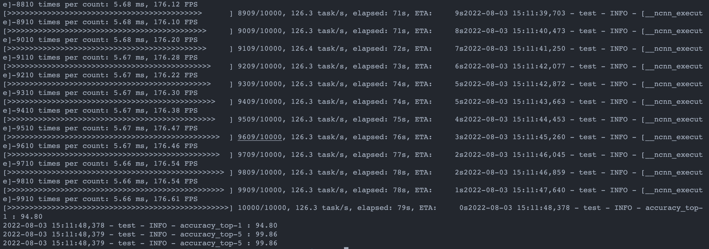
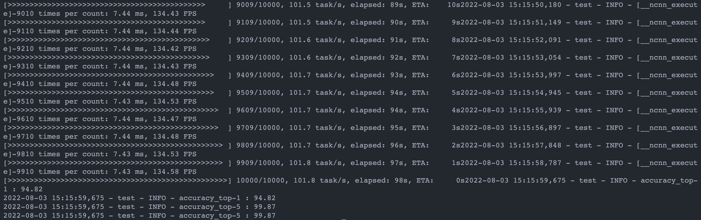
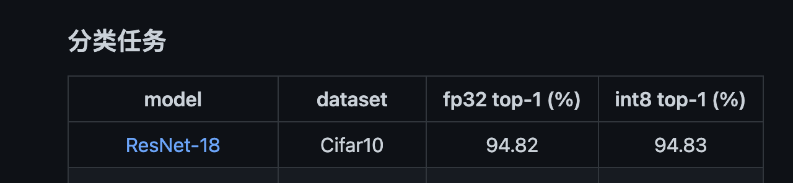
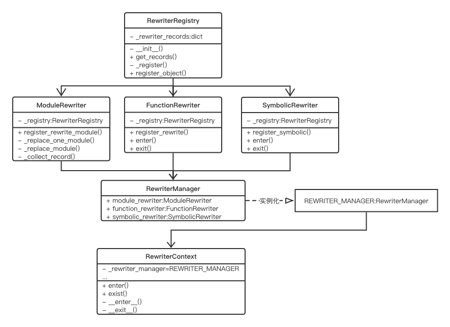

# Convert and quantize Resnet to ncnn-int8

## 1. Convert and quantize Resnet

官方文档：[Convert and quantize tutorial](https://github.com/open-mmlab/mmdeploy/blob/master/docs/zh_cn/02-how-to-run/quantize_model.md)，具体的参数设置可阅读`deploy/tools/deploy.py`。

```bash
export PATH=${PATH}:${NCNN_DIR}/build/install/bin # onnx2ncnn path

python ${MMDEPLOY_DIR}/tools/deploy.py \
${MMDEPLOY_DIR}/configs/mmcls/classification_ncnn-int8_static.py \
${MMCLS_DIR}/configs/resnet/resnet18_8xb16_cifar10.py \
${MMCLS_DIR}/checkpoints/resnet18_b16x8_cifar10_20210528-bd6371c8.pth \
${MMCLS_DIR}/demo/demo.JPEG \
--work-dir ${WORK_DIR} \
--device cpu \
--quant
```

`deploy.py`的主要功能是将OpenMMlab模型转换成各种后端（ONNX, TensorRT, ncnn, PPLNN, OPenVINO）的模型文件，模型量化（fp32->int8）。

以resnet转ncnn-int8为例，deploy的完整工作流程如下：
1. 加载配置文件，即模型配置文件`model_cfg`和部署配置文件`deploy_cfg`。
2. 将torch模型转ir（end2end.onnx）
3. 将IR转至后端ncnn-fp32(end2end.param和end2end.bin)
4. 量化
    - 根据ncnn-fp32模型，利用ppq量化工具，生成量化表（end2end.table）
    - 将ncnn-fp32模型转换成ncnn-int8（end2end_int8.param和end2end_int8.bin）
5. 运行后端模型对测试图像输出推理结果(如果是跑在服务器上，没有图像输出，是会跳过这一步的)


PS：其中获得模型的ir表示后，如果在`deploy_cfg`中有配置`partition_config`，会对模型进行切分，例如[configs/mmdet/detection/two-stage_partition_ncnn_static.py](https://github.com/open-mmlab/mmdeploy/blob/master/configs/mmdet/detection/two-stage_partition_ncnn_static.py)。

## 2. Profile Resnet

官方文档：[Profile tutorial](https://github.com/open-mmlab/mmdeploy/blob/master/docs/zh_cn/02-how-to-run/profile_model.md)

```bash
python ${MMDEPLOY_DIR}/tools/test.py \
${MMDEPLOY_DIR}/configs/mmcls/classification_ncnn-int8_static.py \
${MMCLS_DIR}/configs/resnet/resnet18_8xb16_cifar10.py \
--model resnet18_ncnn_int8/end2end.param resnet18_ncnn_int8/end2end.bin \
--metrics accuracy \
--speed-test \
--device cpu
```

resnet-int8在Cifar10上的测试结果：

<left></left>

resnet-fp32在Cifar10上的测试结果：
<left></left>

<table width=600 border=1>
<tr align=center> <td> Model </td> <td> dataset </td> <td> fp32 top-1 (%) </td> <td> fp32 FPS </td> <td> int8 top-1 (%) </td> <td> int8 FPS </td> </tr>
<tr align=center> <td> Resnet18 </td> <td> Cifar10 </td> <td> 94.82 </td> <td> 134.50 </td> <td> 94.80 </td> <td> 176.30 </td> </tr>
</table>

resnet18在量化后，cifar10上的精度下降0.2个点，但是FPS增加了将近31%。

官方提供的[benchmark](https://github.com/open-mmlab/mmdeploy/blob/master/docs/zh_cn/03-benchmark/quantization.md)：

<left></left>

## 3. Operation Rewriting

参考：
[记录 mmdeploy 部署 ViT 到 ncnn](https://zhuanlan.zhihu.com/p/505481568)

### 3.1 解决算子不匹配的问题

无论是将Pytorch模型转ONNX模型，还是在将ONNX模型转NCNN模型的过程中，都可能会遇到不同推理框架下算子不匹配的问题。

例如在将ViT模型部署至ncnn的过程中，ONNX是不支持`MultiheadAttention`这个算子的，但是ncnn支持。

- [onnx算子表](https://github.com/onnx/onnx/blob/main/docs/Operators.md)
- [ncnn算子表](https://github.com/Tencent/ncnn/blob/master/docs/developer-guide/operators.md#multiheadattention:~:text=support_inplace-,MultiHeadAttention,-split%20q%20k)

首先看`mmcls/backbones/vision_transformer.py`，在`TransformerEncoderLayer`的定义中使用了`MultiheadAttention`操作。

`MultiheadAttention`的具体实现位于`mmcls/models/utils/attention.py`。

由于ONNX不支持`MultiheadAttention`这个算子，在torch2onnx的时候，会将其拆开。然而在ncnn中是有这个算子的，所以要在要将`MultiheadAttention`打包成一个算子转成的onnx模型。

在[mmdeploy-tutorial](https://github.com/open-mmlab/mmdeploy/blob/master/docs/zh_cn/05-tutorial/04_onnx_custom_op.md#%E8%87%AA%E5%AE%9A%E4%B9%89-onnx-%E7%AE%97%E5%AD%90)中介绍了在torch2onnx过程中自定义onnx算子的方法。（非常👍）

mmdeploy采用了第三种自定义onnx算子的方法，用`torch.autograd.Function`来把算子的底层调用封装起来，并在其中定义了`symbolic`静态方法，那么该`Function`在执行`torch.onnx.export()`时就可以根据`symbolic`中定义的规则转换成 ONNX 算子。

而针对`MultiheadAttention`这个算子，mmdeploy对其`forward`方法进行了重写。

```Python
# mmdeploy/codebase/mmcls/models/utils/attention.py
@FUNCTION_REWRITER.register_rewriter(
    func_name='mmcls.models.utils.attention.MultiheadAttention.forward',
    backend=Backend.NCNN.value)
def multiheadattention__forward__ncnn(ctx, self, qkv_input):
    
    ...

    out = MultiHeadAttentionop.apply(qkv_input, qkv_input, qkv_input, q_weight,
                                     q_bias, k_weight, k_bias, v_weight,
                                     v_bias, o_weight, o_bias, self.embed_dims,
                                     self.num_heads)
    return out
```

最后一行代码前都是关于权重的预处理过程，而最后一行调用了`MultiHeadAttentionop.apply`。接着跳转就会发现`MultiHeadAttentionop`是`torch.autograd.Function`的子类，其中实现了`symbolic`静态方法。因此，在将`MultiheadAttention`这个算子从Pytorch转至onnx时，就会按照`symbolic`方法中的定义，生成一个名为`mmdeploy::MultiHeadAttention`的ONNX算子。

```Python
# mmdeploy/mmcv/cnn/transformer.py
class MultiHeadAttentionop(torch.autograd.Function):
    """Create onnx::MultiHeadAttention op."""

    @staticmethod
    def forward(ctx, q: Tensor, k: Tensor, v: Tensor, q_weight: Tensor,
                q_bias: Tensor, k_weight: Tensor, k_bias: Tensor,
                v_weight: Tensor, v_bias: Tensor, o_weight: Tensor,
                o_bias: Tensor, embed_dims: int, num_heads: int) -> Tensor:
        return torch.rand_like(q)

    @staticmethod
    def symbolic(g, q: torch._C.Value, k: torch._C.Value, v: torch._C.Value,
                 q_weight: torch._C.Value, q_bias: torch._C.Value,
                 k_weight: torch._C.Value, k_bias: torch._C.Value,
                 v_weight: torch._C.Value, v_bias: torch._C.Value,
                 o_weight: torch._C.Value, o_bias: torch._C.Value,
                 embed_dims: int, num_heads: int):

        q_weight.setDebugName('q_weight')
        q_bias.setDebugName('q_bias')

        k_weight.setDebugName('k_weight')
        k_bias.setDebugName('k_bias')

        v_weight.setDebugName('v_weight')
        v_bias.setDebugName('v_bias')

        o_weight.setDebugName('o_weight')
        o_bias.setDebugName('o_bias')

        return g.op(
            'mmdeploy::MultiHeadAttention',
            q,
            k,
            v,
            q_weight,
            q_bias,
            k_weight,
            k_bias,
            v_weight,
            v_bias,
            o_weight,
            o_bias,
            embed_dim_i=embed_dims,
            num_heads_i=num_heads)
```

可以看到在`forward`方法中并未实现MultiHeadAttention的具体推理逻辑，但是确保了输入的数目和输出的张量的维度是正确的。如果不用onnxruntime做推理，那么forward的具体逻辑就可以不实现，但是需要确保输入的数目和输出的维度是正确的。因为关注的是模型转换能否正确的转换这个算子，没有考虑onnxruntime的推理结果。

而考虑到量化的过程中，需要调用ppq对模型的权重进行量化，同样需要确保在ppq中实现MultiHeadAttention这个算子。

### 3.2 重写机制

参考：[mmdeploy-support_new_model](https://github.com/open-mmlab/mmdeploy/blob/master/docs/zh_cn/04-developer-guide/support_new_model.md)

重写的代码位于`mmdeploy/core/rewriters`。

该module中实现了三个重写类：`FuctionRewriter`，`ModuleRewriter`和`SymbolicRewriter`类。而在`RewriterManager`类中定义了三个属性，分别是三个重写类的实例。

**记录重写信息**

`RewriterManager`类的实例`REWRITER_MANAGER`是一个全局变量。当我们需要重写function，module或者symbolic时，需要调用`REWRITER_MANAGER`的对应属性`FUNCTION_REWRITER`, `MODULE_REWRITER`或`SYMBOLIC_REWRITER`中的`regisyer_xxx()`方法，从而将重写信息记录在该属性的`_registry`中。

**重写的实现**

对于function和symbolic，重写过程由`RewriterContext`进行管理，其`enter()`方法中又调用了`REWRITER_MANAGER`对象中`FUNCTION_REWRITER`属性和`SYMBOLIC_REWRITER`属性的`enter()`方法。而具体重写过程的实现就是在`enter()`方法中实现的。

对于model，重写过程被包装在`patch_model`方法中，其中直接调用了`MODULE_REWRITER`的`patch_model`方法。

**何时启动重写**

mmdeploy在`mmdeploy/apis/onnx/export.py`中包装了`torch.onnx.export`方法。

在调用`torch.onnx.export`将torch模型转至onnx前，调用了`RewriterContext`和`patch_model`对需要重写的fucntion，symbolic和model先进行了重写。





