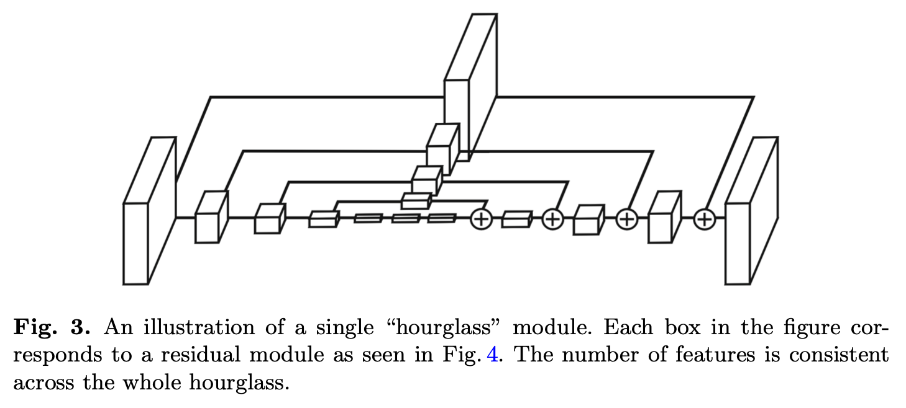
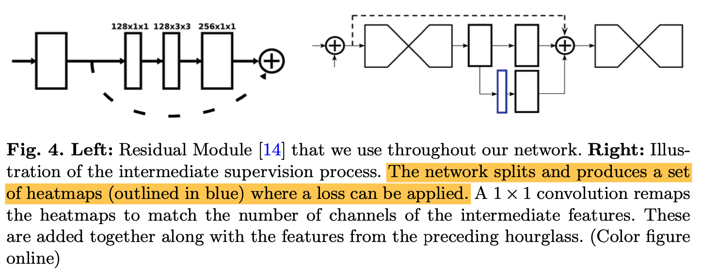

# Hourglass

本文旨在提出一种捕获图像多尺度特征的网络，用以提升姿态检测的性能。不同于其它模型处理多尺度特征的结构，本文提出的模型的自下而上（低分辨率->高分辨率）处理特征的能力和自上而下（高分辨率->低分辨率）处理特征的能力更为对称，这也是取决于沙漏模块（Hourglass）的设计。

图1

<left></left>

沙漏模块的设计动机是姿态检测模型需要捕获图像各个尺度的信息。之前的方法通常采用多个分支分别单独处理不同分辨率的图像，然后将不同分辨率的特征拼接到起来实现融合。但是，本文采用的是一个带有跳跃连接的单支结构。

图2

<left></left>

图1中的每个立方体都对应图2左边这样的一个残差模块。而图1中不同大小的立方体则表示残差模块处理的是不同分辨率的特征图。

Hourglass的模块结构很简单，是一个类似auto-encoder的全卷积结构。

一个完整的姿态检测网络由多个图1所示的Hourglass模块堆叠而成。这样的堆叠使网络能够反复地评估Hourglass模块输出的特征，但是这需要引入额外的监督。如图2右边所示，在每一个Hourglass模块后，作者增加了一个蓝色的1\*1卷积，将特征图映射至w\*h\*keypoint_num维度（基于heatmap的姿态检测模型输出就是一个特征图，其中通道维度等于keypoint的数量）用以计算这个模块姿态检测的损失。

值得注意的是：
- 在文中作者提到上采样并不是通过unpooling和deconv实现的，而是采用了nearest neighbor upsampling方法。 
- 考虑到模型参数量的问题，模型中特征图的最高分辨率是64\*64(因此输出的是64\*64\*keypoint_num)。所以对于256的或者更高分辨率的图像，需要先进行下采样至64。

